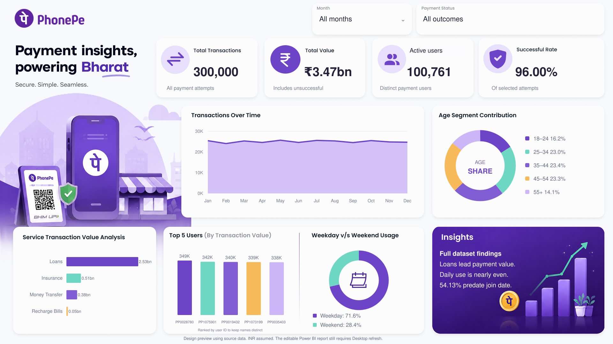

# PhonePe Payment Analytics

A six-page Power BI project analyzing payment activity, service performance, customer usage, payment reliability and data quality in the supplied PhonePe dataset.

The dataset covers **1 January–30 December 2024**. These findings describe the supplied workbook; they are not verified companywide PhonePe results.

*The image above is a design preview generated from the source figures, not a screenshot of a running Power BI report.*

**Key metrics**

| Metric | Result |
| --- | ---: |
| Payment attempts | 300,000 |
| Successful attempts | 287,993 |
| Unsuccessful attempts | 12,007 |
| Success rate | 96.00% |
| Active payment users | 100,761 |
| User profiles | 107,658 |
| Total attempted value | ₹347.43 Cr |
| Successful payment value | ₹333.30 Cr |

INR is assumed from the supplied branding because the workbook has no currency field. One crore equals 10 million. Payment value is not revenue, profit or verified settlement.

**Report pages**

1. **Overview:** headline metrics, monthly volume, age contribution, service value, top users and weekday/weekend usage.
2. **Services:** transaction volume, successful value, average ticket and service-type comparisons.
3. **Reliability:** unsuccessful payments, failure reasons and monthly success rates.
4. **Customers:** active users, repeat activity, use of multiple services and daily usage.
5. **Data quality:** source-status mapping, transactions before recorded join dates and validation checks.
6. **Transactions:** detailed records with original status and normalized outcome.

**Main findings**

- Money Transfer accounts for 50% of payment attempts.
- The source Loans group contributes approximately 72.9% of successful payment value. This group also contains Mutual Fund and Credit Score, so its meaning needs source confirmation.
- Weekdays have 71.6% of attempts, but their daily average is only 0.48% higher than weekends.
- There are 2,027 records with error labels in the payment-status field. They are classified as unsuccessful, with the original values retained.
- There are 162,399 transactions before the recorded user join date. Signup, tenure and retention analysis therefore require source corrections.

**Open the report**

1. Download or clone the complete repository to your Windows computer.
2. Open `PhonePe.pbip` in Power BI Desktop.
3. Select **Home → Transform data**.
4. In Power Query Editor, select **Home → Manage Parameters**.
5. Set **DataFolder** to the full local path of this repository's `Data` folder, without quotation marks.
6. Select **OK → Close & Apply**. Refresh if prompted.
7. Clear the report filters and check for 300,000 payment attempts and 100,761 active users.

Keep `PhonePe.Report`, `PhonePe.SemanticModel` and `PhonePe.pbip` together. This revision imports the prepared CSV files; editing the original Excel workbook alone does not update the report. See [START_HERE.txt](START_HERE.txt) for further instructions.

**Repository contents**

| File or folder | Purpose |
| --- | --- |
| `PhonePe.pbip` | Power BI project entry point |
| `PhonePe.Report/` | Native report definitions and branding assets |
| `PhonePe.SemanticModel/` | Tables, relationships, import queries and 31 DAX measures |
| `Data/` | Users, transactions and calendar CSV files used by the report |
| `PowerQuery/` | Readable copies of the import queries and folder parameter |
| `Measures.dax` | Readable DAX measure definitions |
| `Analysis/` | Full analysis, summary CSVs, field definitions and validation results |
| `Dashboard_Preview.png` | Dashboard design preview |
| `START_HERE.txt` | Setup instructions and troubleshooting |

The original workbook in `Source/` and the SVG version of the preview are optional supporting files. The current report refresh does not depend on them.

**Validation status**

Source records, amounts, CSV exports, key relationships and report structure were checked. All 300,000 attempts are retained, and monetary totals reconcile to the cent.

An earlier version failed to refresh in Power BI Desktop. The current version replaces embedded data queries with independent CSV imports and corrects the background-image reference. The revised refresh, DAX execution and native rendering have not yet been confirmed in Power BI Desktop.

**Data handling**

The full dataset includes user names, identifiers and payment records. Keep the complete repository private unless the dataset and supplied branding are approved for public redistribution.

This project uses Power BI report definitions, a semantic model, Power Query M, DAX and prepared CSV data. It is not an official PhonePe product.
